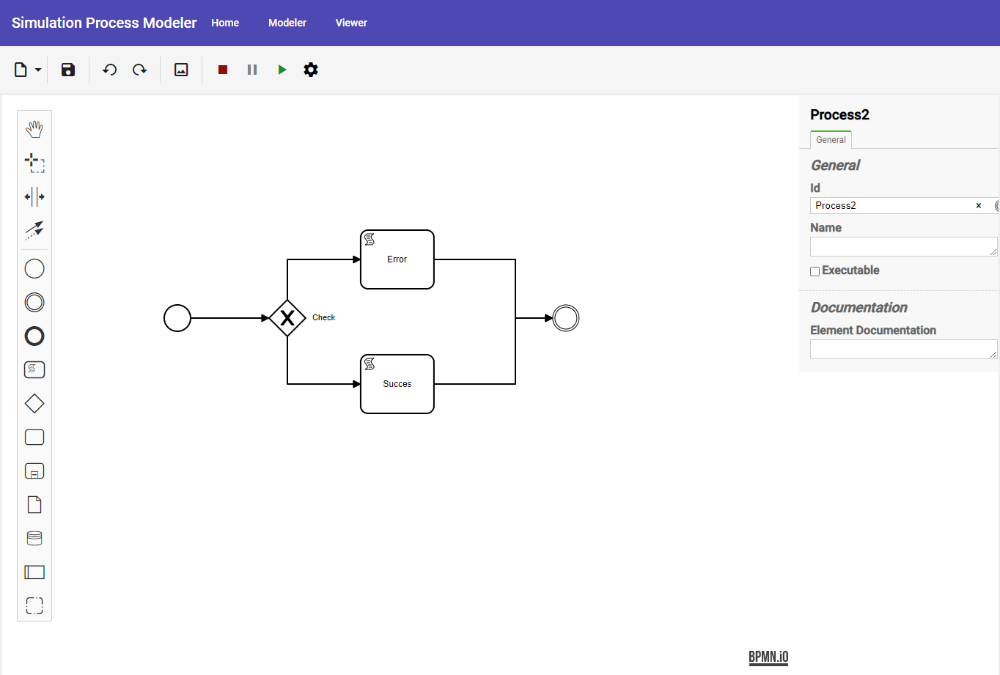

# ProcessModeler

Web based editor for process modeling based on BPMN diagrams.
[Demo](https://sim-process-modeler.herokuapp.com/)

The application was developed as part of the Master's thesis.

Application offers applying code to the diagram elements so that further on the API server could be compiled and simulate the process.
Also, application have build in monaco editor with Groovy syntax highlighting feature.

### Development server

Run `ng serve` for a dev server. Navigate to `http://localhost:4200/`. The app will automatically reload if you change any of the source files.

